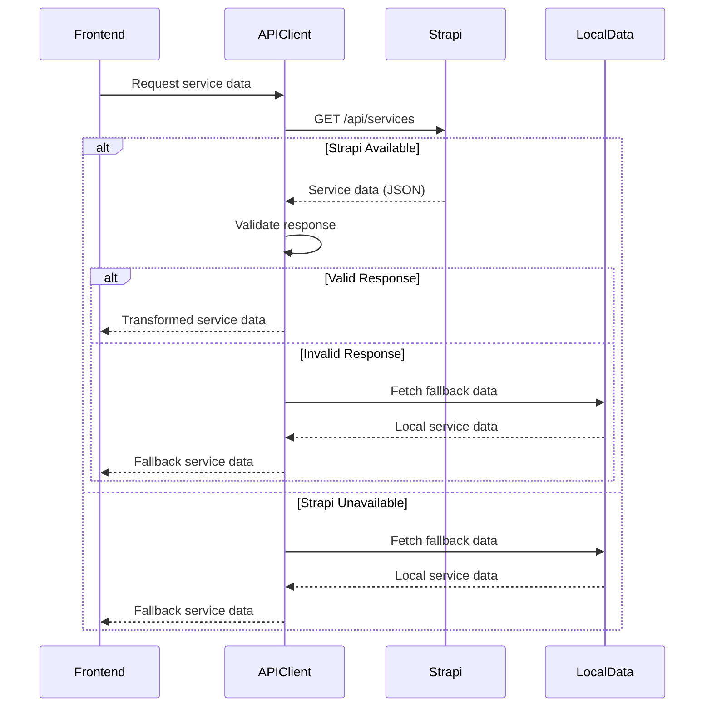

# Design Document: Strapi Services Integration

## Overview

This design addresses the integration of the Strapi services content type with the King & Carter Premier web application. The system currently has a partially implemented Strapi backend with a services content type and migration scripts, plus a frontend with fallback logic to use local service data. This design provides a production-ready solution with proper validation, error handling, environment configuration, and data synchronization.

### Goals

- Ensure data integrity through comprehensive schema validation in Strapi
- Provide reliable, idempotent migration scripts for database initialization
- Implement robust API client with environment-specific configuration
- Maintain application availability through intelligent fallback mechanisms
- Synchronize local and Strapi data structures for consistency
- Validate API responses to prevent runtime errors
- Support different behaviors across development and production environments
- Expose properly configured Strapi API endpoints with CORS support
- Provide testing and validation tools for integration verification

### Non-Goals

- Implementing a full CMS admin interface beyond Strapi's built-in capabilities
- Real-time synchronization between Strapi and local data
- Multi-language support for service content
- Image upload and management (using existing image URLs)
- Authentication/authorization for service endpoints (public data)

## Architecture

### System Components

The integration consists of three primary layers:

1. **Strapi Backend Layer**
   - Service content type with JSON schema validation
   - RESTful API endpoints for service data
   - Migration scripts for data population
   - CORS configuration for frontend access

2. **API Client Layer**
   - Environment-aware configuration
   - HTTP client with error handling
   - Response validation and transformation
   - Fallback mechanism coordination

3. **Frontend Application Layer**
   - Service data consumption
   - Local fallback data
   - Error boundary handling

### Data Flow



### Environment Configuration

The system adapts behavior based on environment:

- **Development**: Detailed logging, localhost defaults, permissive error handling
- **Production**: Minimal logging, explicit configuration required, graceful degradation

## Components and Interfaces

### 1. Service Content Type Schema

**Location**: `backend/src/api/service/content-types/service/schema.json`

**Current Structure**:
```json
{
  "kind": "collectionType",
  "collectionName": "services",
  "attributes": {
    "serviceId": { "type": "uid", "required": true },
    "heroTitle": { "type": "string", "required": true },
    "heroTagline": { "type": "text", "required": true },
    "heroImage": { "type": "string", "required": true },
    "description": { "type": "json", "required": true },
    "highlights": { "type": "json", "required": true },
    "images": { "type": "json", "required": true },
    "cta": { "type": "json", "required": true }
  }
}
```

**Enhanced Validation**:
- Add unique constraint on `serviceId` field
- Implement custom validation for JSON fields to ensure array/object structure
- Add lifecycle hooks for data validation before save

### 2. Migration Script Module

**Location**: `backend/scripts/migrate-services.js`

**Interface**:
```javascript
interface MigrationOptions {
  dryRun?: boolean;      // Report changes without applying
  validate?: boolean;     // Check data integrity only
  force?: boolean;        // Update existing services
}

interface MigrationResult {
  created: number;
  updated: number;
  failed: number;
  errors: Array<{serviceId: string, error: string}>;
}

async function migrateServices(options?: MigrationOptions): Promise<MigrationResult>
```

**Responsibilities**:
- Check for existing services by `serviceId`
- Update existing services or create new ones
- Validate data structure before insertion
- Log detailed results and errors
- Support dry-run and validation modes
- Maintain idempotency across multiple runs

### 3. API Client Module

**Location**: `src/data/strapiServices.js` → `src/api/strapiClient.js`

**Interface**:
```javascript
interface StrapiConfig {
  baseURL: string;
  timeout?: number;
  environment: 'development' | 'production';
}

interface ServiceData {
  id: string;
  heroTitle: string;
  heroTagline: string;
  heroImage: string;
  description: string[];
  highlights: string[];
  images: string[];
  cta: {
    text: string;
    buttonLabel: string;
  };
}

class StrapiClient {
  constructor(config: StrapiConfig);
  
  async fetchServices(): Promise<Record<string, ServiceData>>;
  async fetchServiceById(serviceId: string): Promise<ServiceData | null>;
  async healthCheck(): Promise<boolean>;
  async validateData(): Promise<ValidationResult>;
}
```

**Responsibilities**:
- Read configuration from environment variables
- Make HTTP requests to Strapi API
- Validate response structure and data types
- Transform Strapi responses to match local data format
- Handle network errors and malformed responses
- Coordinate fallback to local data
- Log errors appropriately for environment
- Provide health check and validation utilities

### 4. Response Validator

**Location**: `src/api/validators/serviceValidator.js`

**Interface**:
```javascript
interface ValidationError {
  field: string;
  message: string;
  value: any;
}

interface ValidationResult {
  valid: boolean;
  errors: ValidationError[];
}

function validateServiceData(data: any): ValidationResult;
function validateServiceArray(data: any): ValidationResult;
```

**Validation Rules**:
- `serviceId`: non-empty string
- `heroTitle`: non-empty string
- `heroTagline`: non-empty string
- `heroImage`: non-empty string (URL format)
- `description`: array of non-empty strings
- `highlights`: array of non-empty strings
- `images`: array of non-empty strings (URL format)
- `cta`: object with `text` and `buttonLabel` string properties

### 5. Environment Configuration Module

**Location**: `src/config/strapi.js`

**Interface**:
```javascript
interface StrapiEnvironmentConfig {
  apiUrl: string;
  timeout: number;
  enableDetailedLogging: boolean;
  requireExplicitConfig: boolean;
}

function getStrapiConfig(): StrapiEnvironmentConfig;
```

**Configuration Sources**:
- `VITE_STRAPI_URL`: Strapi API base URL
- `VITE_STRAPI_TIMEOUT`: Request timeout in milliseconds
- `NODE_ENV`: Environment detection

**Defaults**:
- Development: `http://localhost:1337`, 5000ms timeout, detailed logging
- Production: No default URL (must be explicit), 10000ms timeout, minimal logging

### 6. Strapi API Endpoints

**Base URL**: `{STRAPI_URL}/api`

**Endpoints**:

1. **GET /api/services**
   - Returns all services
   - Response format: `{ data: Array<{id: number, attributes: ServiceData}> }`
   - Supports pagination, sorting

2. **GET /api/services?filters[serviceId][$eq]={serviceId}**
   - Returns services filtered by serviceId
   - Response format: `{ data: Array<{id: number, attributes: ServiceData}> }`

**CORS Configuration**:
- Allow origins: Frontend domain(s)
- Allow methods: GET, OPTIONS
- Allow headers: Content-Type, Authorization
- Credentials: false (public data)

## Data Models

### Service Data Model

**TypeScript Definition**:
```typescript
interface ServiceData {
  id: string;                    // Unique identifier (kebab-case)
  heroTitle: string;             // Display title
  heroTagline: string;           // Subtitle/tagline
  heroImage: string;             // Hero image URL
  description: string[];         // Array of paragraph strings
  highlights: string[];          // Array of feature highlights
  images: string[];              // Array of gallery image URLs
  cta: {
    text: string;                // CTA promotional text
    buttonLabel: string;         // CTA button label
  };
}
```

**Strapi Response Format**:
```typescript
interface StrapiServiceResponse {
  data: Array<{
    id: number;                  // Strapi internal ID
    attributes: {
      serviceId: string;         // Our unique identifier
      heroTitle: string;
      heroTagline: string;
      heroImage: string;
      description: string[];     // Stored as JSON
      highlights: string[];      // Stored as JSON
      images: string[];          // Stored as JSON
      cta: {                     // Stored as JSON
        text: string;
        buttonLabel: string;
      };
      createdAt: string;         // ISO timestamp
      updatedAt: string;         // ISO timestamp
    };
  }>;
  meta: {
    pagination?: {
      page: number;
      pageSize: number;
      pageCount: number;
      total: number;
    };
  };
}
```

### Migration Data Format

The migration script uses the same data structure as `src/data/services.js`:

```javascript
const servicesData = {
  'service-id': {
    id: 'service-id',
    heroTitle: 'Service Title',
    heroTagline: 'Service tagline',
    heroImage: '/image/path.png',
    description: ['Paragraph 1', 'Paragraph 2'],
    highlights: ['Feature 1', 'Feature 2'],
    images: ['/image/1.png', '/image/2.png'],
    cta: {
      text: 'CTA text',
      buttonLabel: 'Button label'
    }
  }
};
```

### Error Response Model

```typescript
interface ErrorResponse {
  error: {
    status: number;
    name: string;
    message: string;
    details?: any;
  };
}
```


## Correctness Properties

A property is a characteristic or behavior that should hold true across all valid executions of a system—essentially, a formal statement about what the system should do. Properties serve as the bridge between human-readable specifications and machine-verifiable correctness guarantees.

### Property Reflection

After analyzing all acceptance criteria, several redundancies were identified:

- Properties 2.1, 9.1, and 9.2 all test idempotency and duplicate prevention - these can be combined into a single comprehensive idempotency property
- Properties 2.2 and 9.3 both test update behavior - these can be combined
- Properties 1.2 and 1.3 test the same validation pattern for different fields - these can be combined into a single property about non-empty string validation
- Properties 1.4, 1.5, and 1.6 test the same validation pattern for array fields - these can be combined
- Properties 4.1 and 4.2 both test fallback triggering - these can be combined into a comprehensive fallback property
- Properties 6.2 and 6.3 both test fallback on validation failure - these can be combined with 4.1/4.2

### Property 1: Service ID Uniqueness

For any two service entries in the Strapi database, their serviceId values must be distinct, and attempting to create a service with an existing serviceId should either fail or update the existing service.

**Validates: Requirements 1.1**

### Property 2: Non-Empty String Field Validation

For any service data submitted to Strapi, all string fields (heroTitle, heroTagline, heroImage) must be non-empty strings, and any submission with empty or whitespace-only values for these fields should be rejected.

**Validates: Requirements 1.2, 1.3**

### Property 3: Array Field Structure Validation

For any service data submitted to Strapi, the description, highlights, and images fields must be JSON arrays containing only non-empty strings, and any submission with non-array values or arrays containing non-string elements should be rejected.

**Validates: Requirements 1.4, 1.5, 1.6, 6.5**

### Property 4: CTA Object Structure Validation

For any service data submitted to Strapi, the cta field must be a JSON object containing both text and buttonLabel properties as non-empty strings, and any submission with missing properties or non-string values should be rejected.

**Validates: Requirements 1.7**

### Property 5: Migration Idempotency

For any set of service data, running the migration script multiple times should produce the same final database state, with no duplicate services created and all services present exactly once.

**Validates: Requirements 2.1, 9.1, 9.2**

### Property 6: Migration Update Behavior

For any existing service in the database, when the migration script runs with updated data for that serviceId, the existing service should be updated with the new data rather than creating a duplicate entry.

**Validates: Requirements 2.2, 9.3**

### Property 7: Migration Error Resilience

For any set of service data where some services have validation errors, the migration script should process all valid services successfully and report specific errors for invalid services without halting execution.

**Validates: Requirements 2.3**

### Property 8: Migration Result Reporting

For any migration execution, the script should return accurate counts of services created, updated, and failed that match the actual database operations performed.

**Validates: Requirements 2.4**

### Property 9: Migration Pre-Validation

For any service data with structural errors, the migration script should detect and reject the invalid data before attempting any database operations.

**Validates: Requirements 2.5**

### Property 10: API Client Fallback on Failure

For any condition where Strapi is unreachable, returns error responses, or returns invalid data, the API client should return local service data and log an appropriate warning without throwing errors.

**Validates: Requirements 3.3, 3.4, 3.5, 4.1, 4.2, 4.3, 6.2, 6.3, 7.5**

### Property 11: Response Structure Validation

For any response received from Strapi, the API client should validate that the response contains all required fields with correct types before using the data, and invalid responses should trigger the fallback mechanism.

**Validates: Requirements 6.1**

### Property 12: Service ID Matching

For any service requested by serviceId, the API client should validate that the returned service data contains a matching serviceId, and mismatched responses should trigger the fallback mechanism.

**Validates: Requirements 6.4**

### Property 13: Fallback Data Completeness

For all service IDs present in the local fallback data, each service should contain all required fields (id, heroTitle, heroTagline, heroImage, description, highlights, images, cta) with valid data structures.

**Validates: Requirements 4.4, 4.5**

### Property 14: Data Structure Synchronization

For any service data, the structure used in the migration script, local services file, and Strapi schema should be equivalent, such that data can be transformed between formats without loss of information.

**Validates: Requirements 5.1, 5.4**

### Property 15: Migration Sync Capability

For any changes made to local service data, running the migration script should synchronize those changes to Strapi, updating existing services with the new data.

**Validates: Requirements 5.2**

### Property 16: Service Filtering

For any serviceId query parameter, the Strapi API should return only services matching that serviceId, and the result set should contain at most one service (due to uniqueness constraint).

**Validates: Requirements 8.2**

### Property 17: Consistent Service Ordering

For any sequence of requests to fetch all services from Strapi, the order of services in the response should be consistent across requests when no data modifications occur between requests.

**Validates: Requirements 8.3**

### Property 18: JSON Response Format

For any successful request to the Strapi services API, the response should have Content-Type header set to application/json and the body should be valid JSON.

**Validates: Requirements 8.5**

### Property 19: Timestamp Preservation on Update

For any existing service that is updated by the migration script, the createdAt timestamp should remain unchanged while the updatedAt timestamp should be modified to reflect the update time.

**Validates: Requirements 9.4, 9.5**

### Property 20: Validation Error Reporting

For any validation failure detected by the validation function, the function should return specific details about which fields failed validation and why, rather than generic error messages.

**Validates: Requirements 10.5**


## Error Handling

### Error Categories

1. **Network Errors**
   - Connection timeout
   - Connection refused
   - DNS resolution failure
   - Network unreachable

2. **HTTP Errors**
   - 4xx client errors (400, 404, etc.)
   - 5xx server errors (500, 503, etc.)
   - Invalid response format

3. **Validation Errors**
   - Missing required fields
   - Invalid data types
   - Malformed JSON
   - Schema constraint violations

4. **Migration Errors**
   - Database connection failures
   - Constraint violations
   - Invalid service data
   - Partial migration failures

### Error Handling Strategies

#### API Client Error Handling

```javascript
try {
  const response = await axios.get(`${STRAPI_URL}/api/services`);
  
  // Validate response structure
  const validationResult = validateServiceArray(response.data);
  if (!validationResult.valid) {
    logger.warn('Invalid response from Strapi', validationResult.errors);
    return getFallbackData();
  }
  
  return transformResponse(response.data);
  
} catch (error) {
  if (error.code === 'ECONNREFUSED' || error.code === 'ETIMEDOUT') {
    logger.warn('Strapi unavailable, using fallback data');
  } else if (error.response) {
    logger.error('Strapi returned error', {
      status: error.response.status,
      message: error.response.data?.error?.message
    });
  } else {
    logger.error('Unexpected error fetching from Strapi', error.message);
  }
  
  return getFallbackData();
}
```

#### Migration Script Error Handling

```javascript
const results = {
  created: 0,
  updated: 0,
  failed: 0,
  errors: []
};

for (const [serviceId, serviceData] of Object.entries(servicesData)) {
  try {
    // Validate before attempting database operation
    const validationResult = validateServiceData(serviceData);
    if (!validationResult.valid) {
      results.failed++;
      results.errors.push({
        serviceId,
        error: `Validation failed: ${validationResult.errors.map(e => e.message).join(', ')}`
      });
      continue;
    }
    
    // Attempt upsert operation
    const existing = await findServiceByServiceId(serviceId);
    if (existing) {
      await updateService(existing.id, serviceData);
      results.updated++;
    } else {
      await createService(serviceData);
      results.created++;
    }
    
  } catch (error) {
    results.failed++;
    results.errors.push({
      serviceId,
      error: error.message
    });
    logger.error(`Failed to migrate service ${serviceId}:`, error);
  }
}

return results;
```

#### Environment-Specific Error Logging

**Development Environment**:
```javascript
logger.error('Strapi API Error', {
  url: request.url,
  method: request.method,
  status: error.response?.status,
  statusText: error.response?.statusText,
  data: error.response?.data,
  stack: error.stack
});
```

**Production Environment**:
```javascript
logger.error('Service data fetch failed', {
  status: error.response?.status,
  fallback: 'using local data'
});
```

### Graceful Degradation

The system prioritizes availability over consistency:

1. **Primary Path**: Fetch from Strapi API
2. **Fallback Path**: Use local service data
3. **Error Boundary**: Prevent application crashes

This ensures the application remains functional even when Strapi is unavailable, with the trade-off that content may not reflect the latest CMS updates until Strapi is restored.

## Testing Strategy

### Dual Testing Approach

This feature requires both unit tests and property-based tests to ensure comprehensive coverage:

- **Unit tests**: Verify specific examples, edge cases, error conditions, and integration points
- **Property-based tests**: Verify universal properties across randomized inputs

Together, these approaches provide confidence that the system behaves correctly across all scenarios.

### Property-Based Testing

**Library**: `fast-check` (JavaScript/TypeScript property-based testing library)

**Configuration**:
- Minimum 100 iterations per property test
- Each test tagged with feature name and property reference
- Generators for service data, invalid data, and edge cases

**Property Test Examples**:

```javascript
// Property 3: Array Field Structure Validation
describe('Feature: strapi-services-integration, Property 3: Array field structure validation', () => {
  it('should reject service data with non-array or non-string-array fields', () => {
    fc.assert(
      fc.property(
        fc.record({
          description: fc.oneof(
            fc.constant(null),
            fc.constant({}),
            fc.array(fc.integer()),
            fc.string()
          ),
          highlights: fc.oneof(
            fc.constant(null),
            fc.array(fc.boolean()),
            fc.integer()
          ),
          images: fc.oneof(
            fc.array(fc.constant(null)),
            fc.constant('not-an-array')
          )
        }),
        (invalidData) => {
          const result = validateServiceData({
            ...validServiceBase,
            ...invalidData
          });
          expect(result.valid).toBe(false);
        }
      ),
      { numRuns: 100 }
    );
  });
});

// Property 5: Migration Idempotency
describe('Feature: strapi-services-integration, Property 5: Migration idempotency', () => {
  it('should produce same database state when run multiple times', async () => {
    fc.assert(
      fc.asyncProperty(
        fc.array(generateValidServiceData(), { minLength: 1, maxLength: 10 }),
        async (servicesData) => {
          // Clear database
          await clearServicesTable();
          
          // Run migration first time
          const result1 = await migrateServices(servicesData);
          const state1 = await getAllServices();
          
          // Run migration second time
          const result2 = await migrateServices(servicesData);
          const state2 = await getAllServices();
          
          // States should be identical
          expect(state2).toEqual(state1);
          expect(state2.length).toBe(servicesData.length);
        }
      ),
      { numRuns: 100 }
    );
  });
});

// Property 10: API Client Fallback on Failure
describe('Feature: strapi-services-integration, Property 10: API client fallback on failure', () => {
  it('should return local data when Strapi fails', () => {
    fc.assert(
      fc.asyncProperty(
        fc.oneof(
          fc.constant('ECONNREFUSED'),
          fc.constant('ETIMEDOUT'),
          fc.integer({ min: 400, max: 599 }),
          fc.constant('INVALID_JSON')
        ),
        async (errorType) => {
          // Mock Strapi failure
          mockStrapiError(errorType);
          
          // Fetch services
          const result = await apiClient.fetchServices();
          
          // Should return local data
          expect(result).toEqual(localServicesData);
          
          // Should log warning
          expect(logger.warn).toHaveBeenCalled();
        }
      ),
      { numRuns: 100 }
    );
  });
});
```

### Unit Testing

**Framework**: Vitest (already configured in project)

**Test Categories**:

1. **Schema Validation Tests**
   - Valid service data passes validation
   - Empty strings are rejected
   - Invalid JSON structures are rejected
   - Missing required fields are rejected

2. **Migration Script Tests**
   - Creates new services successfully
   - Updates existing services
   - Handles validation errors gracefully
   - Reports accurate results
   - Dry-run mode doesn't modify database
   - Validation mode checks without changes

3. **API Client Tests**
   - Reads configuration from environment
   - Uses correct defaults per environment
   - Transforms Strapi responses correctly
   - Falls back to local data on errors
   - Validates responses before use
   - Logs appropriately per environment

4. **Integration Tests**
   - End-to-end service fetch from Strapi
   - Migration followed by API fetch
   - CORS headers present on requests
   - Health check detects Strapi availability

5. **Edge Case Tests**
   - Empty service list
   - Single service
   - Service with minimal data
   - Service with maximum data
   - Unicode characters in strings
   - Very long arrays

**Example Unit Tests**:

```javascript
describe('Service Validation', () => {
  it('should accept valid service data', () => {
    const validService = {
      id: 'test-service',
      heroTitle: 'Test Service',
      heroTagline: 'Test tagline',
      heroImage: '/image/test.png',
      description: ['Paragraph 1', 'Paragraph 2'],
      highlights: ['Feature 1', 'Feature 2'],
      images: ['/image/1.png', '/image/2.png'],
      cta: { text: 'CTA text', buttonLabel: 'Button' }
    };
    
    const result = validateServiceData(validService);
    expect(result.valid).toBe(true);
    expect(result.errors).toHaveLength(0);
  });
  
  it('should reject service with empty heroTitle', () => {
    const invalidService = {
      ...validServiceBase,
      heroTitle: ''
    };
    
    const result = validateServiceData(invalidService);
    expect(result.valid).toBe(false);
    expect(result.errors).toContainEqual(
      expect.objectContaining({ field: 'heroTitle' })
    );
  });
});

describe('Migration Script', () => {
  beforeEach(async () => {
    await clearServicesTable();
  });
  
  it('should create new services', async () => {
    const result = await migrateServices({
      'test-service': validServiceData
    });
    
    expect(result.created).toBe(1);
    expect(result.updated).toBe(0);
    expect(result.failed).toBe(0);
    
    const service = await findServiceByServiceId('test-service');
    expect(service).toBeDefined();
  });
  
  it('should update existing services', async () => {
    // Create initial service
    await createService(validServiceData);
    
    // Update with new data
    const updatedData = {
      ...validServiceData,
      heroTitle: 'Updated Title'
    };
    
    const result = await migrateServices({
      'test-service': updatedData
    });
    
    expect(result.created).toBe(0);
    expect(result.updated).toBe(1);
    expect(result.failed).toBe(0);
    
    const service = await findServiceByServiceId('test-service');
    expect(service.heroTitle).toBe('Updated Title');
  });
});

describe('API Client', () => {
  it('should use environment variable for Strapi URL', () => {
    process.env.VITE_STRAPI_URL = 'https://api.example.com';
    const config = getStrapiConfig();
    expect(config.apiUrl).toBe('https://api.example.com');
  });
  
  it('should use localhost default in development', () => {
    delete process.env.VITE_STRAPI_URL;
    process.env.NODE_ENV = 'development';
    const config = getStrapiConfig();
    expect(config.apiUrl).toBe('http://localhost:1337');
  });
  
  it('should fall back to local data on network error', async () => {
    mockAxios.get.mockRejectedValue({ code: 'ECONNREFUSED' });
    
    const result = await apiClient.fetchServices();
    
    expect(result).toEqual(localServicesData);
    expect(logger.warn).toHaveBeenCalledWith(
      expect.stringContaining('unavailable')
    );
  });
});
```

### Test Coverage Goals

- **Line Coverage**: Minimum 80%
- **Branch Coverage**: Minimum 75%
- **Function Coverage**: Minimum 85%
- **Property Tests**: All 20 correctness properties implemented
- **Unit Tests**: All error paths and edge cases covered

### Testing Tools and Validation

**Migration Testing Tools**:
```bash
# Dry-run mode
npm run migrate:services -- --dry-run

# Validation mode
npm run migrate:services -- --validate

# Force update mode
npm run migrate:services -- --force
```

**API Client Testing Tools**:
```javascript
// Health check
const isHealthy = await apiClient.healthCheck();

// Data validation
const validationResult = await apiClient.validateData();
if (!validationResult.valid) {
  console.log('Discrepancies:', validationResult.errors);
}
```

### Continuous Integration

Tests should run automatically on:
- Pull request creation
- Commits to main branch
- Pre-deployment checks

**CI Configuration**:
```yaml
test:
  - npm run test:unit
  - npm run test:property
  - npm run test:integration
  - npm run migrate:services -- --validate
```

